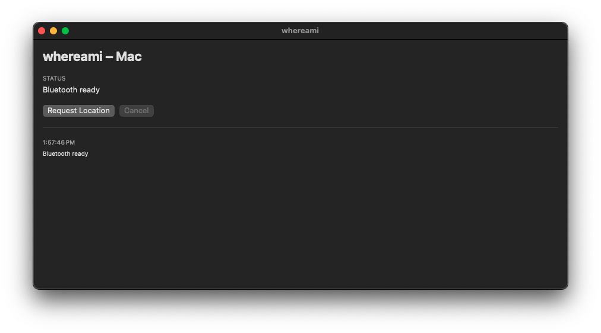
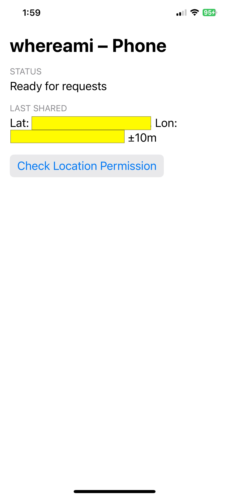
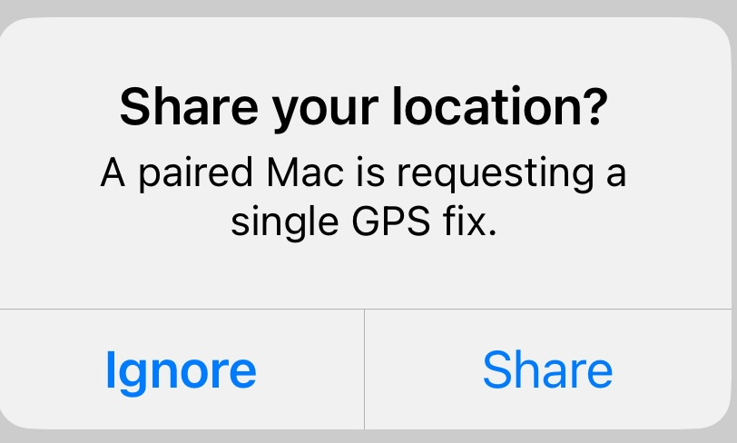

# WhereAmI: Send GPS location from iOS to macOS

WhereAmI sends GPS location from iOS to macOS.
It uses Bluetooth for it.
App must be opened on both devices for the exchange to work.
For the app to work iPhone and Macbook are within the Bluetooth range.
The iOS in this setup acts as the BLE perhipheral.

The purpose is to allow the Macbook to be offline (perhaps during cruise/travel),
but be able to get the physical location taking field notes with accurate
location.

WhereAmI is a universal Swift app that works on macOS and iOS.
For macOS, the two versions are provided: GUI and Command Line Interface (CLI)
tool.
The same codebase is used to run on both platforms.

This is R&D project, and is 100% vibe-coded with the LLM.

The same functionality could perhaps be accomplished by creating the iOS
Shortcut where GPS location is fetched, put into a file, and the file is
somehow transferred via Bluetooth to Mac.

## Testing

Both devices must have the app installed.
On iPhone, the app must be started, and please click the button first and
authorize the access to location API.
Macbook must be within Bluetooth range.

Press a "Request location" button on Macbook.
The iOS app should ask you for permission to do it (screen below).
If everything goes well, the Mac should show you the GPS coordinate.

To test the macOS CLI,

    ✗ ./build/cli/whereami-cli
    [BLELocationClient] request rejected: bluetooth unavailable
    [retry] bluetooth unavailable; waiting for power on (attempt 1)
    [BLELocationClient] central powered on
    [BLELocationClient] request started
    [BLELocationClient] performRequest invoked
    [BLELocationClient] starting scan
    [BLELocationClient] discovered peripheral xxxxxxxx-xxxx-xxxx-xxxx-xxxxxxxxxxxx rssi=-41
    [BLELocationClient] connected to xxxxxxxx-xxxx-xxxx-xxxx-xxxxxxxxxxxx
    [BLELocationClient] service discovered; discovering characteristics
    [BLELocationClient] subscribing to response notifications
    [BLELocationClient] writing request to xxxxxxxx-xxxx-xxxx-xxxx-xxxxxxxxxxxx
    [BLELocationClient] arming response timer
    [BLELocationClient] issuing fallback read for response characteristic
    [BLELocationClient] notify state changed isNotifying=true
    [BLELocationClient] received 174 bytes from peripheral
    [BLELocationClient] got location lat=45.4263 lon=-132.1666 acc=8.46
    {
      "horizontalAccuracy" : y.yyyyyy,
      "latitude" : 45.4263,
      "longitude" : -132.1666,
      "timestamp" : "2025-10-02T21:14:55Z"
    }

The xxxxxxxx-xxxx-..... is the device identifier (for your iPhone), and it'll differ in your case.
I also anonymized the location, which will differ for you based on where you are, physically.
RSSI is a signal strength--that might be different too.
The debug stuff is printed to STDERR.
It's supported to do:

    ./build/cli/whereami-cli > geo.json

and then:

    jq . geo.json

# Building

To build for macOS (UI and CLI) and iOS:

    make mac
    make ios
    make cmd

# macOS 

# iOS

Permission ask will look like this:

# License

BSDv2

# Author

- Adam Koszek, adam@koszek.com
- https://www.koszek.com
